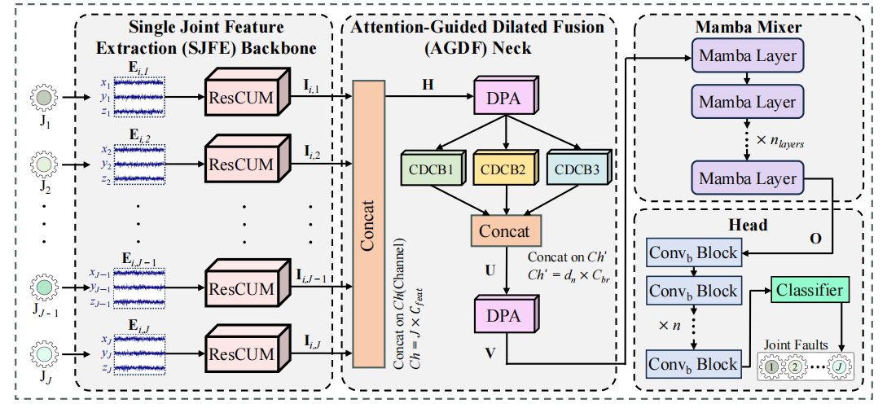

# SMNet

English | [简体中文](README_CN.md)

Official partial implementation of **SMNet: A Novel Compositional Generalization Model for Industrial Robot Multi-Joint Fault Diagnosis**.

| Publication | Details |
| --- | --- |
| Journal | IEEE Internet of Things Journal |
| DOI | [10.1109/JIOT.2026.3652582](https://doi.org/10.1109/JIOT.2026.3652582) |
| Date of Publication | 12 January 2026 |

## Overview

SMNet diagnoses unseen compound joint faults by learning how atomic, joint-level fault signatures compose. It first preserves joint-private information with a Single-Joint Feature Extraction (SJFE) backbone, then uses an Attention-Guided Dilated Fusion (AGDF) neck for multi-scale cross-joint fusion. A Mamba Mixer captures long-range dependencies before the multi-label Head predicts the fault state of each joint.

<p align="center">
  
</p>

The model follows four stages:

1. **SJFE Backbone:** six independent ResCUM branches extract joint-private features from tri-axial vibration signals.
2. **AGDF Neck:** Dual-Path Attention (CBAM1D and CSA) is applied before and after three parallel Cascaded Dilated Convolution Blocks with dilation rates 1, 2, and 3.
3. **Mamba Mixer:** three Mamba layers with an embedding dimension of 48 model long-range temporal and cross-joint dependencies.
4. **Head:** three convolutional blocks and an MLP produce six joint-level logits for multi-label diagnosis.

## Release Status

This repository is intentionally released in stages. At present, only `model.py` is public. The vibration data were collected with an industrial partner that does not plan to release the dataset, so neither the raw nor processed data can be distributed. To make the experimental protocol clear, a compact dataset description is provided below. We plan to release the complete training and evaluation code in a future update.

## Model Usage

The implementation requires PyTorch and the official [Mamba](https://github.com/state-spaces/mamba) package.

```bash
pip install torch causal-conv1d mamba-ssm --no-build-isolation
```

## Dataset Description

The study uses in-situ vibration measurements from a six-joint industrial robot. A tri-axial sensor is mounted at every joint, giving 18 synchronized channels. Each example contains 2,560 time points and is assigned a six-bit multi-label vector, where `1` indicates a faulty joint. Faults are introduced only at J1-J4; J5 and J6 remain healthy throughout the current benchmark.

DatasetA contains normal, single-joint, and double-joint conditions and is divided into 70% training, 20% validation, and 10% TestA data. DatasetB contains fault combinations that are not observed during training: its three-joint cases form TestB3 and its four-joint case forms TestB4. Each listed condition contributes 4,000 windows.

| Dataset | Class ID | Fault Joint(s) | Joint Label | Sample Detail |
| --- | ---: | --- | --- | --- |
| DatasetA | 1-4 | None | `(0, 0, 0, 0, 0, 0)` | `4 × 4000 × (2560, 18)` |
| DatasetA | 5 | J1 | `(1, 0, 0, 0, 0, 0)` | `4000 × (2560, 18)` |
| DatasetA | 6 | J2 | `(0, 1, 0, 0, 0, 0)` | `4000 × (2560, 18)` |
| DatasetA | 7 | J3 | `(0, 0, 1, 0, 0, 0)` | `4000 × (2560, 18)` |
| DatasetA | 8 | J4 | `(0, 0, 0, 1, 0, 0)` | `4000 × (2560, 18)` |
| DatasetA | 9 | J1+J2 | `(1, 1, 0, 0, 0, 0)` | `4000 × (2560, 18)` |
| DatasetA | 10 | J1+J3 | `(1, 0, 1, 0, 0, 0)` | `4000 × (2560, 18)` |
| DatasetA | 11 | J1+J4 | `(1, 0, 0, 1, 0, 0)` | `4000 × (2560, 18)` |
| DatasetA | 12 | J2+J3 | `(0, 1, 1, 0, 0, 0)` | `4000 × (2560, 18)` |
| DatasetA | 13 | J2+J4 | `(0, 1, 0, 1, 0, 0)` | `4000 × (2560, 18)` |
| DatasetA | 14 | J3+J4 | `(0, 0, 1, 1, 0, 0)` | `4000 × (2560, 18)` |
| DatasetB | 15 | J1+J2+J3 | `(1, 1, 1, 0, 0, 0)` | `4000 × (2560, 18)` |
| DatasetB | 16 | J1+J2+J4 | `(1, 1, 0, 1, 0, 0)` | `4000 × (2560, 18)` |
| DatasetB | 17 | J1+J3+J4 | `(1, 0, 1, 1, 0, 0)` | `4000 × (2560, 18)` |
| DatasetB | 18 | J2+J3+J4 | `(0, 1, 1, 1, 0, 0)` | `4000 × (2560, 18)` |
| DatasetB | 19 | J1+J2+J3+J4 | `(1, 1, 1, 1, 0, 0)` | `4000 × (2560, 18)` |

## Results

P, R, and F1 denote macro-averaged Precision, Recall, and F1-score.

### Simple Fault Diagnosis on DatasetA (TestA)

| Model | Params | FLOPs (MFLOPs) | P / R / F1 |
| --- | ---: | ---: | --- |
| WDCNN | **0.052M** | **6.00** | 0.8996 / 0.8734 / 0.8864 |
| TICNN | 0.161M | 203.20 | 0.8673 / 0.8806 / 0.8689 |
| SRDCNN | 0.158M | 135.24 | **0.9753** / 0.7908 / 0.8731 |
| CNN-LSTM | 0.182M | 245.90 | 0.8974 / 0.8220 / 0.8559 |
| MSMCNN | 0.115M | 363.86 | 0.9119 / 0.9337 / 0.9149 |
| MJAR | 0.756M | 419.08 | 0.9703 / 0.9623 / 0.9658 |
| **SMNet (Ours)** | 0.868M | 426.23 | 0.9700 / **0.9858** / **0.9776** |

### Compositional Generalization on DatasetB

| Model | P / R / F1 (TestB3) | P / R / F1 (TestB4) |
| --- | --- | --- |
| WDCNN | 0.9963 / 0.6129 / 0.7585 | **1.0000** / 0.4697 / 0.6386 |
| TICNN | 0.9970 / 0.6225 / 0.7667 | **1.0000** / 0.4705 / 0.6399 |
| SRDCNN | 0.9054 / 0.5575 / 0.6901 | 0.9664 / 0.4974 / 0.6566 |
| CNN-LSTM | 0.9765 / 0.7499 / 0.8483 | **1.0000** / 0.6639 / 0.7980 |
| MSMCNN | **0.9999** / 0.6921 / 0.8180 | **1.0000** / 0.5504 / 0.7042 |
| MJAR | 0.9998 / 0.8980 / 0.9462 | **1.0000** / 0.8606 / 0.9251 |
| **SMNet (Ours)** | 0.9862 / **0.9726** / **0.9791** | **1.0000** / **0.8665** / **0.9270** |

## Citation

If SMNet is useful in your research, we welcome you to cite our paper:

```bibtex
@article{hu2026smnet,
  title={SMNet: A Novel Compositional Generalization Model for Industrial Robot Multi-Joint Fault Diagnosis},
  author={Hu, Xiaoxi and Jiang, Chengzhi and Huang, Yuhan and Peng, Dandan and Su, Hao and He, Yiming and Chen, Zhuyun},
  journal={IEEE Internet of Things Journal},
  year={2026},
  publisher={IEEE}
}
```
