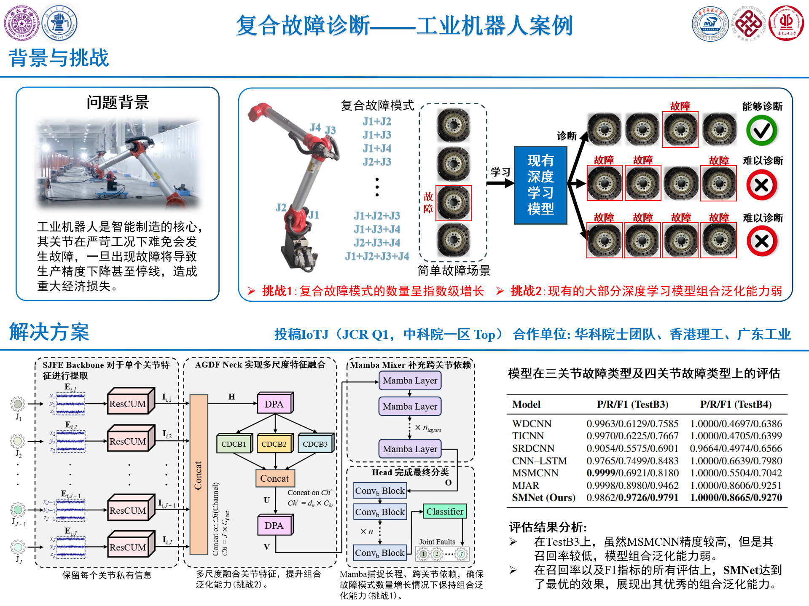

# SMNet

[English](README.md) | 简体中文

**SMNet: A Novel Compositional Generalization Model for Industrial Robot Multi-Joint Fault Diagnosis** 的官方部分开源实现。

| 论文信息 | 内容 |
| --- | --- |
| 期刊 | IEEE Internet of Things Journal |
| DOI | [10.1109/JIOT.2026.3652582](https://doi.org/10.1109/JIOT.2026.3652582) |
| 发表日期 | 2026年1月12日 |

## 简介

SMNet面向工业机器人多关节复合故障诊断，通过学习关节级原子故障特征的组合规律，识别训练阶段未出现的高阶复合故障。模型先利用单关节特征提取（SJFE）主干保留各关节的私有信息，再通过注意力引导扩张融合（AGDF）颈部完成多尺度跨关节融合，随后由Mamba Mixer建模长程依赖，最后通过多标签分类头判断各关节的故障状态。

<p align="center">
  
</p>

## 开源说明

本仓库采用分阶段开源方式，目前仅公开`model.py`。本文振动数据由课题组与工业合作厂商共同采集，但合作厂商暂无公开数据的计划，因此现阶段无法提供原始数据或处理后的数据。为便于读者了解实验设置，下面给出了简要的数据集说明与类别构成。完整的训练和评估代码计划在后续更新中开源。

## 模型使用

代码依赖PyTorch与官方[Mamba](https://github.com/state-spaces/mamba)实现。

```bash
pip install torch causal-conv1d mamba-ssm --no-build-isolation
```

## 数据集说明

实验数据来自一台六关节工业机器人。每个关节均安装三轴振动传感器，因此一次采样包含18个同步通道；每个样本由2,560个时间点组成，并使用六维多标签向量表示故障位置，其中`1`表示对应关节发生故障。当前数据中的故障只设置在J1-J4，J5与J6在所有工况下均保持正常。

DatasetA由正常、单关节故障和双关节故障组成，按照70%、20%和10%划分为训练集、验证集和TestA。DatasetB只包含训练阶段未出现的复合故障，其中三关节故障组成TestB3，四关节故障组成TestB4。表中每种工况均包含4,000个样本窗口。

| 数据集 | 类别ID | 故障关节 | 关节标签 | 样本规模 |
| --- | ---: | --- | --- | --- |
| DatasetA | 1-4 | 无 | `(0, 0, 0, 0, 0, 0)` | `4 × 4000 × (2560, 18)` |
| DatasetA | 5 | J1 | `(1, 0, 0, 0, 0, 0)` | `4000 × (2560, 18)` |
| DatasetA | 6 | J2 | `(0, 1, 0, 0, 0, 0)` | `4000 × (2560, 18)` |
| DatasetA | 7 | J3 | `(0, 0, 1, 0, 0, 0)` | `4000 × (2560, 18)` |
| DatasetA | 8 | J4 | `(0, 0, 0, 1, 0, 0)` | `4000 × (2560, 18)` |
| DatasetA | 9 | J1+J2 | `(1, 1, 0, 0, 0, 0)` | `4000 × (2560, 18)` |
| DatasetA | 10 | J1+J3 | `(1, 0, 1, 0, 0, 0)` | `4000 × (2560, 18)` |
| DatasetA | 11 | J1+J4 | `(1, 0, 0, 1, 0, 0)` | `4000 × (2560, 18)` |
| DatasetA | 12 | J2+J3 | `(0, 1, 1, 0, 0, 0)` | `4000 × (2560, 18)` |
| DatasetA | 13 | J2+J4 | `(0, 1, 0, 1, 0, 0)` | `4000 × (2560, 18)` |
| DatasetA | 14 | J3+J4 | `(0, 0, 1, 1, 0, 0)` | `4000 × (2560, 18)` |
| DatasetB | 15 | J1+J2+J3 | `(1, 1, 1, 0, 0, 0)` | `4000 × (2560, 18)` |
| DatasetB | 16 | J1+J2+J4 | `(1, 1, 0, 1, 0, 0)` | `4000 × (2560, 18)` |
| DatasetB | 17 | J1+J3+J4 | `(1, 0, 1, 1, 0, 0)` | `4000 × (2560, 18)` |
| DatasetB | 18 | J2+J3+J4 | `(0, 1, 1, 1, 0, 0)` | `4000 × (2560, 18)` |
| DatasetB | 19 | J1+J2+J3+J4 | `(1, 1, 1, 1, 0, 0)` | `4000 × (2560, 18)` |

## 实验结果

P、R和F1分别表示宏平均Precision、Recall和F1-score。

### DatasetA上的简单故障诊断结果（TestA）

| 模型 | 参数量 | FLOPs (MFLOPs) | P / R / F1 |
| --- | ---: | ---: | --- |
| WDCNN | **0.052M** | **6.00** | 0.8996 / 0.8734 / 0.8864 |
| TICNN | 0.161M | 203.20 | 0.8673 / 0.8806 / 0.8689 |
| SRDCNN | 0.158M | 135.24 | **0.9753** / 0.7908 / 0.8731 |
| CNN-LSTM | 0.182M | 245.90 | 0.8974 / 0.8220 / 0.8559 |
| MSMCNN | 0.115M | 363.86 | 0.9119 / 0.9337 / 0.9149 |
| MJAR | 0.756M | 419.08 | 0.9703 / 0.9623 / 0.9658 |
| **SMNet（本文）** | 0.868M | 426.23 | 0.9700 / **0.9858** / **0.9776** |

### DatasetB上的组合泛化结果

| 模型 | P / R / F1（TestB3） | P / R / F1（TestB4） |
| --- | --- | --- |
| WDCNN | 0.9963 / 0.6129 / 0.7585 | **1.0000** / 0.4697 / 0.6386 |
| TICNN | 0.9970 / 0.6225 / 0.7667 | **1.0000** / 0.4705 / 0.6399 |
| SRDCNN | 0.9054 / 0.5575 / 0.6901 | 0.9664 / 0.4974 / 0.6566 |
| CNN-LSTM | 0.9765 / 0.7499 / 0.8483 | **1.0000** / 0.6639 / 0.7980 |
| MSMCNN | **0.9999** / 0.6921 / 0.8180 | **1.0000** / 0.5504 / 0.7042 |
| MJAR | 0.9998 / 0.8980 / 0.9462 | **1.0000** / 0.8606 / 0.9251 |
| **SMNet（本文）** | 0.9862 / **0.9726** / **0.9791** | **1.0000** / **0.8665** / **0.9270** |

## 引用

如果SMNet对您的研究有所帮助，欢迎引用我们的论文：

```bibtex
@article{hu2026smnet,
  title={SMNet: A Novel Compositional Generalization Model for Industrial Robot Multi-Joint Fault Diagnosis},
  author={Hu, Xiaoxi and Jiang, Chengzhi and Huang, Yuhan and Peng, Dandan and Su, Hao and He, Yiming and Chen, Zhuyun},
  journal={IEEE Internet of Things Journal},
  year={2026},
  publisher={IEEE}
}
```
